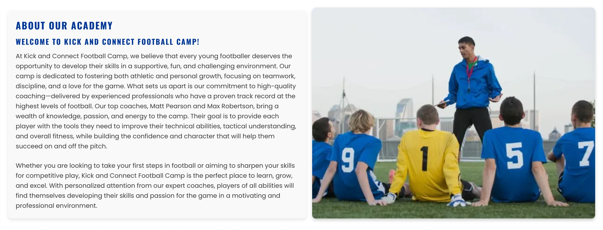

# Kick & Connect

The Kick and Connect Football Camp website is designed to offer a user-friendly, engaging experience for parents and young athletes passionate about football. It highlights the camp's various programs, including skill development, teamwork, and fun, while providing easy navigation to key sections like the camp’s mission, coaching team, schedule, and registration. From the homepage, visitors are greeted with vibrant images and essential information about the camp's philosophy, and they can easily register or sign up for more details. The site is mobile-friendly and features interactive elements such as Google Maps and a contact form, ensuring parents can quickly find what they need. Tailored for families of children aged 6 to 15, the website appeals to both football enthusiasts and parents seeking a safe, professional environment where seasoned coaches, like Matt Pearson and Max Robertson, provide top-notch training, making it an ideal resource for those valuing sportsmanship and skill-building.

## Planning
The planning of the Kick and Connect Football Camp website was a thoughtful process focused on user experience and brand identity. I began by sketching wireframe drawings to map out the layout of each page, ensuring that the site would be intuitive and easy to navigate for both parents and children. These wireframes helped visualize the structure, from the homepage to specific sections like registration and daily schedules. To create a cohesive and appealing visual identity, I used a color palette selector to carefully choose the brand colors. This step ensured that the website would reflect the camp's energetic and professional atmosphere, while also being visually appealing to the target audience.

### Index Wireframe

### About Us Wireframe

### Contact Wireframe

## Features

### Navigation
The navigation on our website is designed to be simple and user-friendly, ensuring an intuitive browsing experience. With a clean layout and clear links, users can easily navigate between sections. On mobile devices, the navigation seamlessly collapses into a convenient burger menu, keeping the design uncluttered while maintaining full functionality. The menu is fully responsive, adapting to different screen sizes to provide a consistent and smooth experience across all devices.

### Hero images

The hero images used on the Kick and Connect Football Camp website are highly effective because they immediately capture the essence of the camp, showcasing the excitement and energy of soccer. These visually engaging images create an inviting atmosphere, grabbing the attention of both children and their parents, which aligns with the target audience. By using dynamic action shots and scenes related to the sport, the hero images help to build a connection with the audience, sparking interest and enthusiasm for joining the camp.

### Intro to the camp

The intro and image on the index page work well to engage visitors by immediately showcasing the camp's focus on football. The clear and concise text provides key information about the camp, while the image reflects the energetic and fun atmosphere. Together, they create a welcoming first impression, drawing in the target audience of children and parents interested in a football camp that emphasizes skill-building and teamwork.

### Skills and training 

The skills and training section is ideal for the target audience, showcasing the camp's focus on improving football techniques and teamwork. Its responsive design ensures easy access across devices, making it convenient for both parents and kids to learn about the camp’s offerings, building excitement and trust.

### Daily schedule

The daily schedule section provides a clear breakdown of the camp's activities, helping parents and kids understand what to expect. Its responsive layout ensures the schedule is easy to read on any device, making it accessible and convenient for busy families.

### About the academy

The about page offers valuable insight into the camp’s mission, coaches, and overall goals, helping parents and participants feel confident in their decision to join.

### Meet the coaches

The "About the Coaches" section highlights the expertise and qualifications of the coaches, Matt Pearson and Max Robertson, which builds trust with the audience. By showcasing their experience with professional football teams, the section reassures parents and participants that they are in capable hands. Its responsive layout ensures the content is accessible and engaging on all devices, reinforcing confidence and credibility.

### Contact form 

The contact form is designed to facilitate communication between prospective attendees and the camp, allowing users to easily share their inquiries or requests. Upon submission, the form redirects to a thank-you page, confirming receipt of their message. This demo form simulates functionality, as a real implementation would store the information in a database for efficient management and follow-up. The button has been styled in the brands colours.

### Contact details

The contact information section is crucial for the target audience, offering clear details about the Kick and Connect Football Camp. By providing the camp's location, email address, and phone number, potential attendees can easily reach out for inquiries. The embedded Google Maps feature allows users to visualize the camp's location and get directions, enhancing usability and building trust in the camp's professionalism.

### Footer

The footer of the Kick and Connect Football Camp website enhances user experience by providing social media links that allow parents and young athletes to easily connect with the camp's online presence. This fosters community engagement, enabling users to follow updates, share experiences, and stay informed about events. The recognisable icons improve usability, ensuring quick access to preferred platforms. Overall, the footer not only boosts the camp's visibility but also builds trust and rapport with the audience, helping them feel more connected to the camp's activities.

### Accessibility
Our website is designed for accessibility, providing a smooth experience for users with visual impairments or those using screen readers. We use high-contrast colors, legible fonts, and fully support keyboard navigation to enhance readability and ease of use. All images include descriptive alt text, and the site structure follows semantic HTML elements like <header>, <nav>, and <main>, helping screen readers understand the content better. These features ensure a more inclusive, user-friendly experience for everyone.

## Testing
The Kick and Connect Football Camp website underwent thorough testing using HTML and CSS validators to ensure it met web standards and performed efficiently across different browsers. I used an HTML validator to check the structure and ensure that all elements were properly nested and free from errors, enhancing the website's overall functionality. Additionally, I employed a CSS validator to verify that the styling code was accurate and compliant with best practices. This process helped identify and fix any potential issues in the code, ensuring the website’s layout and design would render consistently on all devices. By conducting these validations, I ensured the website maintained a high level of quality and reliability.

In addition to using HTML and CSS validators, the Kick and Connect Football Camp website was tested with Google DevTools to ensure it was fully responsive and performed well across different screen sizes. I used the responsive design mode within DevTools to simulate how the website would look and function on various devices, from desktops to tablets and smartphones. This allowed me to identify and address any layout issues or breakpoints that needed adjustment. By testing across a range of screen sizes, I ensured the website delivers a smooth, user-friendly experience, regardless of the device being used.

#### HTML
Every page was tested individually.  Home.html, about.html, contact.html, and contact-sent.html all passed with no errors were returned when passing through the offical [W3 Html Checker](https://validator.w3.org/nu/?doc=https%3A%2F%2Fnickflanagn24.github.io%2Ffirst-assignment%2F)

#### CSS
Every page was tested individually.  Home.html, about.html, contact.html, and contact-sent.html all passed with no errors were returned when passing through the offical [W3C CSS checker](https://jigsaw.w3.org/css-validator/validator?uri=https%3A%2F%2Fnickflanagn24.github.io%2Ffirst-assignment%2F&profile=css3svg&usermedium=all&warning=1&vextwarning=&lang=en)

### Wave evaluation test

After using the W3 checkers I also ran each page through Wave evaluation tool as seen in the picture.  This was to ensure and confirm that no bugs were missed so the each page would preform how I wanted it to.

#### Google Lighthouse test
##### Mobile test

##### Desktop test 

Each page then was test separately here are the results

### Browser testing
All the pages individually were tested on different screen sizes and on different browsers. They were tested on Chrome, Firefox and Microsoft Edge. This was done to make sure ll user get a great user experience.

## Found bugs and fixes

1) **CSS File Not Linking with HTML**  
+ Bug: The CSS file wasn't loading properly.
+ Fix: Verified the file path and corrected the link in the HTML to ensure it pointed to the right location.

2) **Font Not Changing**
+ Bug: The font was not displaying as intended.
+ Fix: Ensured the correct font-family was specified and imported the fonts properly in the CSS.

3) **X Button Not Disappearing on Tablet View**
+ Bug: The "X" button was visible in tablet view when it should not have been.
+ Fix: Adjusted the CSS for the .nav-toggle-label to hide it in the media query for tablet sizes and larger.

4) **Hover Effects on Navigation Links Not Working**
+ Bug: Links were not underlined on hover.
+ Fix: Added CSS rules for the hover state specifically for screens over 992px.

5) **Background Image Not Displaying**
+ Bug: The hero image was not appearing.
+ Fix: Checked the image path, ensured the correct syntax for the background property, and verified image format compatibility.

6) **Cover Text Not Appearing on Hero Image**
+ Bug: The text was not visible over the hero image.
+ Fix: Moved the #cover-text div inside the #hero section and added CSS to position it correctly.

7) **Unclosed section**
+ Bug: A section on the About page was left open
+ Fix: Added a close section tag

8) **Section without heading**
+ Bug: A section without a heading
+ Fix: I changed the section to a div attribute

## Deployment

The live link for the site can be found: [Click Here](https://nickflanagn24.github.io/first-assignment)

## Credits
### Content 
+ Icons take from [Font Awesome](https://fontawesome.com/)
+ The footer code was taken from the Love Running Project.  The simplicity and how it stuck to the bottom of the screen. It was a great fit for the website.  

### Media
+ The images on the site were taken from [Canva](canva.com)
+ The images where choosen to fit with the website brandings main colour #003399